# PayMe 💳

Sistema completo de pagos y recordatorios por WhatsApp/Telegram desarrollado por Customware.

## Características

### Frontend
- 🚀 Interfaz moderna y responsiva con React 18
- 💱 Múltiples métodos de pago
- 📊 Dashboard de analytics
- ⚡ Rendimiento optimizado con Vite

### Backend
- 📱 Recordatorios automáticos por WhatsApp y Telegram
- 🤖 Bot conversacional con inline keyboards (Telegram)
- 🔄 Pagos recurrentes con confirmación automática
- ✅ Gestión de opt-in cumpliendo políticas de WhatsApp
- 🌍 Multi-tenant con aislamiento completo de datos
- ⏰ Zonas horarias y programación inteligente
- 🔒 Seguridad con RLS y autenticación
- 📊 Métricas y seguimiento de entregas

## Tecnologías

### Frontend
- React 18 + TypeScript + Vite
- Styled Components
- React Query
- React Hook Form + Yup
- Lucide React

### Backend
- Supabase (PostgreSQL + Edge Functions + Auth + RLS)
- WhatsApp Cloud API con templates aprobadas
- Telegram Bot API con inline keyboards
- Scheduler con pg_cron para envíos automáticos
- Deno runtime para Edge Functions

## Instalación

```bash
# Clonar el repositorio
git clone https://github.com/Customware-cl/payme.git
cd payme

# Instalar dependencias del frontend
npm install

# Instalar Supabase CLI
npm install -g supabase

# Iniciar servicios locales de Supabase
supabase start
```

## Scripts Disponibles

### Frontend
- `npm run dev` - Inicia el servidor de desarrollo (Vite)
- `npm run build` - Construye la aplicación para producción
- `npm run preview` - Previsualiza la build de producción
- `npm run lint` - Ejecuta el linter
- `npm run test` - Ejecuta las pruebas

### Backend (Supabase)
- `supabase start` - Inicia Supabase local
- `supabase functions deploy` - Deploya edge functions
- `supabase db reset` - Resetea la base de datos local
- `supabase db push` - Aplica migraciones

## Estructura del Proyecto

```
.
├── src/                    # Frontend React
│   ├── components/         # Componentes reutilizables
│   ├── pages/             # Páginas de la aplicación
│   ├── services/          # Servicios y API calls
│   ├── utils/             # Utilidades y helpers
│   └── types/             # Definiciones de TypeScript
├── supabase/              # Backend Supabase
│   ├── functions/         # Edge Functions (webhooks, procesamiento)
│   │   ├── wa_webhook/    # Webhook WhatsApp
│   │   └── tg_webhook_simple/  # Webhook Telegram con inline keyboards
│   └── migrations/        # Migraciones de base de datos
├── lib/                   # Librerías compartidas backend
└── types/                 # Types de base de datos
```

## Flujo de Uso Implementado

### Estado de Implementación
- ✅ **Implementado**: Funcionalidad completa y operativa
- ⏳ **En Desarrollo**: Parcialmente implementado
- ❌ **Pendiente**: No implementado aún

```mermaid
sequenceDiagram
    autonumber
    participant U as Usuario (WhatsApp)
    participant B as Bot de WhatsApp
    participant BE as Backend (Supabase)
    participant C as Contacto

    Note over U,BE: ✅ FASE 1: Registro e Inicio (IMPLEMENTADO)

    U->>B: Hola / Nuevo préstamo 💰
    B-->>BE: Verificar si el contacto existe

    alt Contacto no registrado
        BE-->>B: Contacto NO existe
        B-->>BE: Registrar automáticamente (phone, WhatsApp ID)
        BE-->>B: Contacto registrado ✅
    else Contacto registrado
        BE-->>B: Contacto existe
    end

    Note over U,BE: ✅ FASE 2: Flujo de Nuevo Préstamo (IMPLEMENTADO)

    B->>U: ¡Hola! 👋 Soy tu asistente de recordatorios<br/>[💰 Nuevo préstamo] [📋 Ver estado] [❓ Ayuda]
    U->>B: Click en "💰 Nuevo préstamo"
    B->>U: ¿A quién se lo vas a prestar?<br/>[Ver contactos ▼]

    alt Seleccionar contacto existente
        U->>B: [Selecciona de lista]
    else Agregar nuevo contacto
        U->>B: [➕ Agregar nuevo contacto]
        B->>U: ¿Puedes enviar el contacto o ingresar su<br/>número de teléfono y nombre?
        U->>B: [Comparte contacto o escribe datos]
        B-->>BE: Registrar nuevo contacto
    end

    B->>U: ¿Qué le vas a prestar a {contacto}?<br/>[💰 Dinero] [📦 Un objeto] [🔧 Otra cosa]
    U->>B: [Selecciona opción]

    alt Préstamo de dinero
        B->>U: ¿Cuánto dinero le vas a prestar?<br/>Ingresa solo el monto (ejemplo: 5000)
        U->>B: [Ingresa monto: 45900]
    else Préstamo de objeto
        B->>U: ¿Qué objeto le vas a prestar?
        U->>B: [Describe objeto]
    else Otra cosa
        B->>U: ¿Qué le vas a prestar?
        U->>B: [Describe]
    end

    B->>U: ¿Para cuándo debe devolver el monto $45.900?<br/>[Mañana] [A fin de mes] [Escribir fecha]
    U->>B: [Selecciona o escribe fecha]
    B-->>BE: Parsear y validar fecha (timezone Chile UTC-3)

    B->>U: Perfecto, voy a registrar:<br/>📝 Préstamo a: {contacto}<br/>💰 Monto: $45.900<br/>📅 Fecha límite: 01/10/25<br/><br/>¿Confirmas que todo está correcto?
    U->>B: Sí

    B-->>BE: Crear agreement en BD con status='active'
    BE->>C: 📩 Notificación automática al contacto<br/>Hola {contacto}, {usuario} te ha prestado<br/>$45.900. Fecha de devolución: 01/10/25
    B->>U: ✅ ¡Préstamo registrado exitosamente!<br/>Te avisaré cuando se acerque la fecha

    Note over U,BE: ✅ FASE 3: Consulta de Estado (IMPLEMENTADO)

    U->>B: Estado / [📋 Ver estado]
    B-->>BE: Query agreements (ordenar + agrupar)
    BE-->>B: Préstamos ordenados por fecha<br/>(agrupados si mismo contacto + fecha)

    B->>U: 📋 Estado de préstamos:<br/><br/>💰 Préstamos que hiciste:<br/>1. A {contacto}: Dinero<br/>   Vence: 02/10/25<br/>   Monto: $49.000<br/><br/>2. A {contacto}: Dinero<br/>   Vence: 31/10/25<br/>   Monto: $244.988<br/><br/>📥 Préstamos que te hicieron:<br/>1. De {prestador}: Dinero<br/>   Vence: 01/11/25

    Note over U,BE: ❌ FASE 4: Recordatorios Automáticos (PENDIENTE)

    rect rgb(200, 200, 200)
        Note over BE: En la fecha programada (pendiente)
        BE-->>B: Disparar evento de recordatorio
        B->>C: 📅 Hola {contacto}, hoy vence tu préstamo<br/>de $45.900 a {usuario}
        B->>C: ¿Ya lo devolviste?<br/>[Sí] [No]
    end

    Note over U,BE: ❌ FASE 5: Seguimiento y Confirmación (PENDIENTE)

    rect rgb(200, 200, 200)
        alt Contacto responde "Sí"
            C->>B: [Sí]
            B-->>BE: Actualizar status='completed'
            B->>U: ✅ {contacto} confirmó que devolvió el préstamo
        else Contacto responde "No"
            C->>B: [No]
            B-->>BE: Actualizar status='overdue'
            Note over BE,C: Día siguiente
            BE-->>B: Recordatorio día +1
            B->>C: Recordatorio: Préstamo pendiente
            alt Responde "Sí"
                C->>B: [Sí]
                B-->>BE: status='completed'
                B->>U: ✅ Préstamo completado
            else Responde "No"
                C->>B: [No]
                Note over BE,C: 3 días después
                BE-->>B: Recordatorio día +3
                B->>C: Último recordatorio
                alt Responde "Sí"
                    C->>B: [Sí]
                    B-->>BE: status='completed'
                    B->>U: ✅ Préstamo completado
                else No responde o responde "No"
                    C->>B: [No / Sin respuesta]
                    B-->>BE: status='defaulted'
                    B->>U: ❌ {contacto} no cumplió con el préstamo
                end
            end
        end
    end
```



### Resumen de Estado

| Fase | Funcionalidad | Estado |
|------|--------------|--------|
| 1 | Registro automático de usuarios | ✅ Implementado |
| 2 | Flujo conversacional de nuevo préstamo | ✅ Implementado |
| 2.1 | Selección/creación de contactos | ✅ Implementado |
| 2.2 | Tipos de préstamo (dinero/objeto/otro) | ✅ Implementado |
| 2.3 | Botones rápidos para fechas | ✅ Implementado |
| 2.4 | Parser de fechas con timezone Chile | ✅ Implementado |
| 2.5 | Formato de montos ($x.xxx) | ✅ Implementado |
| 2.6 | Formato de fechas (dd/mm/aa) | ✅ Implementado |
| 2.7 | Notificación automática al contacto | ⏳ En Desarrollo |
| 3 | Consulta de estado de préstamos | ✅ Implementado |
| 3.1 | Ordenamiento por fecha próxima | ✅ Implementado |
| 3.2 | Agrupación y suma de montos | ✅ Implementado |
| 4 | Recordatorios automáticos programados | ❌ Pendiente |
| 5 | Sistema de seguimiento (día +1, +3) | ❌ Pendiente |
| 5.1 | Confirmación del contacto | ❌ Pendiente |
| 5.2 | Notificaciones al usuario | ❌ Pendiente |

## Funcionalidades Telegram

El bot de Telegram incluye:
- ✅ **Inline Keyboards** para comandos principales (/start)
- 📅 **Botones contextuales** para selección de fechas
- ✅ **Botones de confirmación** en el flujo de préstamos
- 🔄 **Verificación de contactos** antes de crear préstamos
- 💾 **Persistencia de estado** conversacional

## Configuración

### Variables de Entorno

Copia `.env.example` a `.env` y configura:

```env
# Supabase
SUPABASE_URL=tu_url_de_supabase
SUPABASE_ANON_KEY=tu_key_publica
SUPABASE_SERVICE_ROLE_KEY=tu_key_privada

# WhatsApp
WHATSAPP_ACCESS_TOKEN=tu_token
WHATSAPP_PHONE_NUMBER_ID=tu_phone_id
WHATSAPP_VERIFY_TOKEN=tu_verify_token

# Telegram
TELEGRAM_BOT_TOKEN=tu_bot_token
TELEGRAM_SECRET_TOKEN=tu_secret
```

## Contribuir

1. Fork el proyecto
2. Crea tu feature branch (`git checkout -b feature/AmazingFeature`)
3. Commit tus cambios (`git commit -m 'Add some AmazingFeature'`)
4. Push al branch (`git push origin feature/AmazingFeature`)
5. Abre un Pull Request

## Licencia

Este proyecto está licenciado bajo la Licencia MIT.